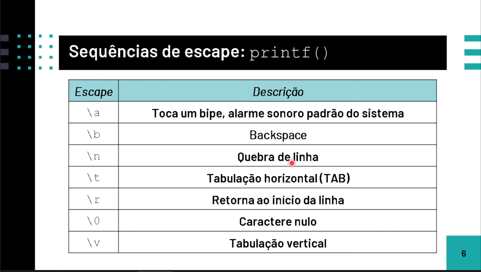
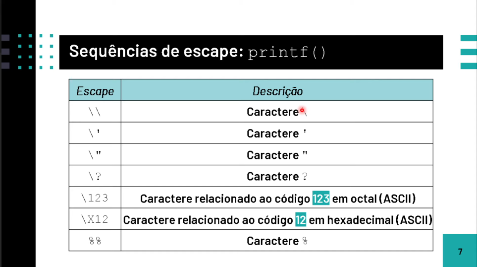
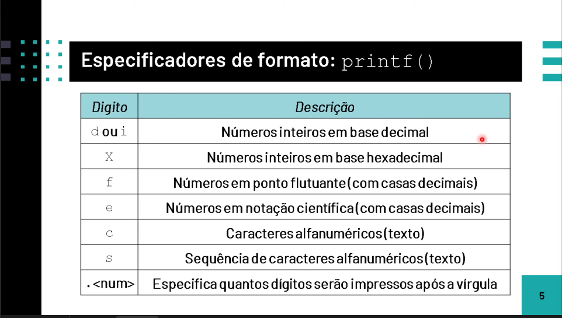
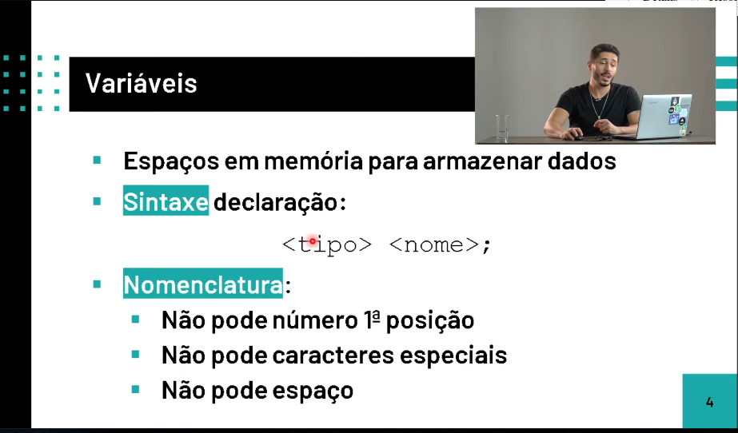
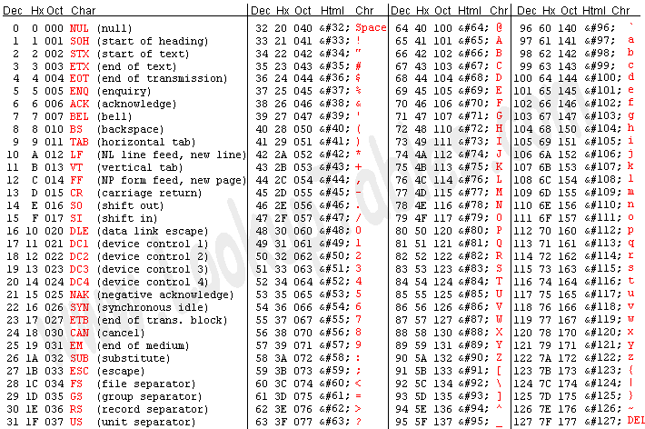
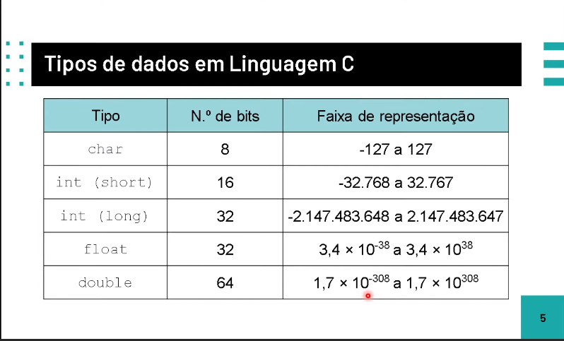

# Lógica de Programação em Linguagem C

## Objetivo do Repositório

- **Mostrar algoritmos escritos em C**
	
## Ferramentas

- **C**
  - **Características**
  - **Bibliotecas(<stdio.h>)**
- **Emacs**

- Compialdor **GCC**

- Debbuger(**GDB**)

## O que é o C?

De forma clássica o C é considerado uma linguagem de alto-nível em comparação a linguagem de máquina e muito mais simples que o _**Assembly**_

Obs.: Há discussões de o C é high-level, medium-level ou low-level

A linguagem C foi criada por *Dennis Ritchie* em 1972

## Usos corriqueiros

- Sistemas Operacionais

- Sistemas Desktop

- Sistemas Embarcados

- Telecomunicações

## Características

- Multiplataforma
- Alto Desempenho
- Proximidade aos Recursos do Hardware

- Sintaxe Rebuscada

- Facilidade em Migrar de Linguagem

- Não suporta POO(Orientação a Objetos)

## Mercado de Trabalho

- Relevante desde sempre

- Salários bons

- Baixa aplicabilidade em **Web** e **Mobile**

## Como funciona?

O C tem uma grande funçaõ *main* onde é nesta função que o código principal será executado

O C tem por si só várias bibliotecas e a usada será a *stdio*

A cada alteração é preciso fazer uma recompilação do código :V

Vamos usa-las :)

## Sintaxe X Semântica

Sintaxe são as regras na programação onde cada linguagem seta elas para maior legebilidade e entendimento

A Semântica envolve a parte lógica como um todo e é passível de mudança e análise se feito de forma errada :) 

### Como compilar um código usando *GCC*

`gcc -o "nome-binario.sh" "arquivo.c`

### Como debugar um código usando *GDB*

```
gcc -g -o "nome-binario.sh" "arquivo.c
gdb ./arquivo.c

(gdb) b(breakpoint), r(run), set(adicionar valor a variaveis), n(next), s(step), p(print), bt, c(continue)

b 5, b main, b x.c:9

```


<div align="center">

<h2>Formatação de Output com a função Printf()</h2>

</img>

</img>

</img>
</div>

## ScanF(input do usuário)

O scanf funciona com um esquema de formatação semelhante ao Printf, a única diferença é que é prciso criar uma variável e escanea-la para o usuário dar um input especificando o endereço.

`int x = 0; scanf("%d", &x)`

| Digito |         Descrição             |
|--------|-------------------------------|
| d ou i |   Números inteiros(decimal)   |
| X ou x | Números inteiros(hexadecimal) |
|   f    |       Números decimais        |
|   e    | Números em notação científica |
|   c    |   Caracteres alfanúmericos    |
|   s    |           Strings             | 
| .<num> | Números impressos após vírgula|

## O que é uma varíavel?

Uma variável é um valor que é reservado na memória do computador, onde tem um endereço e valores.

A varíavel precisa ser inicializa pelo seu tipo e é preciso uma atribuição de valor correspondente ao tipo da variável:

Exemplo abaixo: 

```
ìnt x = 10;
char letra = 'a' ;
char[10] = "Luiz"
float x = 5.25;
double z = 10.544584982553;

```
A varíavel pode variar ao longo do programa podendo ser mudada facilmente, desde que correspondente ao tipo inicializado :) 

## O que é uma constante?

Uma constante é um valor que não pode ser alterado :), há duas formas de definir constantes em C

- A macro **#define**

```
#include <stdio.h>
#define mensagem "oi, tudo bem :)"

int main () {
	
	printf("%s", mensagem);
	return 0;
}
```

- Uma *const* dentro de uma função

```
#include <stdio.h>
int main () {
	const char[50] mensagem = "oi, tudo bem com você?";
    printf("%s", mensagem);
    return 0;
}
```

### Regras na declaração de variaveis

As variáveis tem um certo padraão para a declaração como: `<tipo><nome>`

<div align="center">
	
</div>

### Tipos

Cada varíavel tem um número específico de bits que podem ser armazenados

Variáveis do tipo `char` tem seu conteúdo descrito em 8 bits = 1byte de acordo com a tabela ***ASCII*** abaixo:

<div align="center">
	<br><br>
	<imgr src="ASCII-1.png">
</div>

Vai alguns exemplos abaixo:

<div align="center">
	<h2>Tipos de variaveis</h2>
	<br>
		
</div>

### Operadores Matemáticos

| Sinal |   Operação    |
|-------|---------------|
| **+** |     Soma      |
| **-** |   Subtração   |
| ***** | Multiplicação |
| **/** |    Divisão    |
| **%** |    Módulo     |

- Ordem de Precedência
  - * /
  - %
  - + -

Obs.: Independente da precedência se houver "()", isso será feito: `int valor = (a+b)*2;`

## Atribuições Matemáticas

|   Atr  |           Descrição             |
|--------|---------------------------------|
| **++** |    Incrementa **1** (`x=x+1`)   |
| **--** |   Decrementa **1**  (`x=x+1`)   |
| **+=** |    Incrementa **y** (`x=x+y`)   |
| **-=** |   Decrementa **y**  (`x=x-y`)   | 
| ***=** |    Multiplica **y** (`x=x*y`)   |
| **/=** |    Divide **y** (`x=x/y`)       |
| **%=** |  Calcula modulo **y** (`x=x%y`) |

## Operadores Lógicos

- IF

```
#include <stdio.h>

int main () {

int x = 2;

if (x == 2){
    printf("This is really two, oh my god!");
}
}

```
